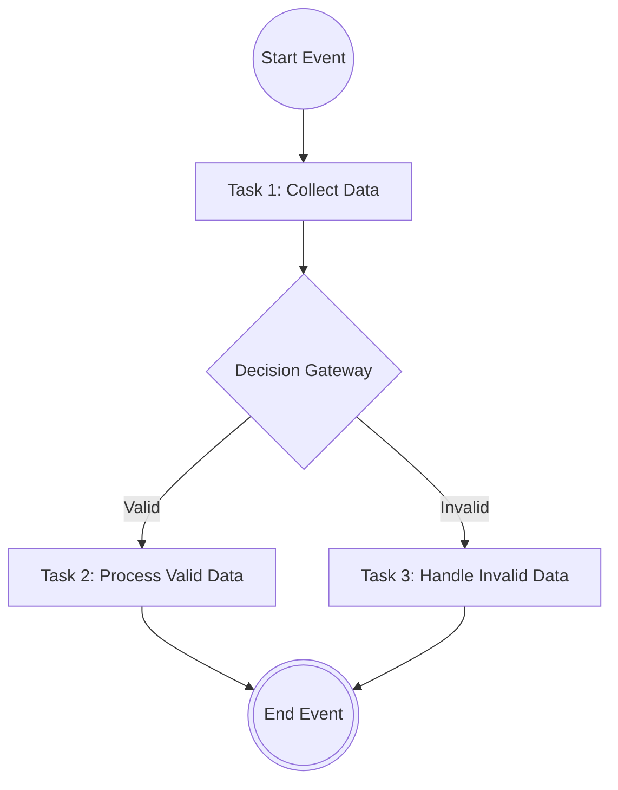

# BPMN Diagram Tool

Uma ferramenta moderna e intuitiva para criar e editar diagramas BPMN com suporte a IA.

## Funcionalidades

- **Editor Visual**: Arraste e solte elementos BPMN para criar diagramas
- **Assistente IA**: Use linguagem natural para modificar seus diagramas
- **Exportação**: Exporte seus diagramas em formato Mermaid ou BPMN XML
- **Importação**: Importe diagramas do formato Mermaid (Nova funcionalidade!)
- **Multilíngue**: Suporte para Português e Inglês

## Como usar a Importação Mermaid

### 1. Criar um arquivo Mermaid

Crie um arquivo `.mmd` com a sintaxe Mermaid. Exemplo:



### 2. Importar o diagrama

1. Abra a aplicação
2. Crie ou selecione um diagrama
3. Clique no botão "Importar" na barra de ferramentas
4. Selecione seu arquivo `.mmd` ou `.txt`
5. O diagrama será automaticamente convertido e carregado

### Tipos de elementos suportados

- **Start Events**: `(("Label"))` - Eventos de início
- **End Events**: `((("Label")))` - Eventos de fim  
- **Tasks**: `["Label"]` - Tarefas
- **Gateways**: `{"Label"}` - Gateways de decisão
- **Connections**: `-->`, `-.->`, `==>` - Diferentes tipos de conexões

### Exemplo de arquivo Mermaid

Veja os arquivos `example-mermaid.mmd` e `simple-example.mmd` na raiz do projeto para exemplos completos.

## Desenvolvimento

```bash
npm install
npm run dev
```

## Tecnologias

- React + TypeScript
- Vite
- Tailwind CSS
- React Flow
- i18next
- Lucide React